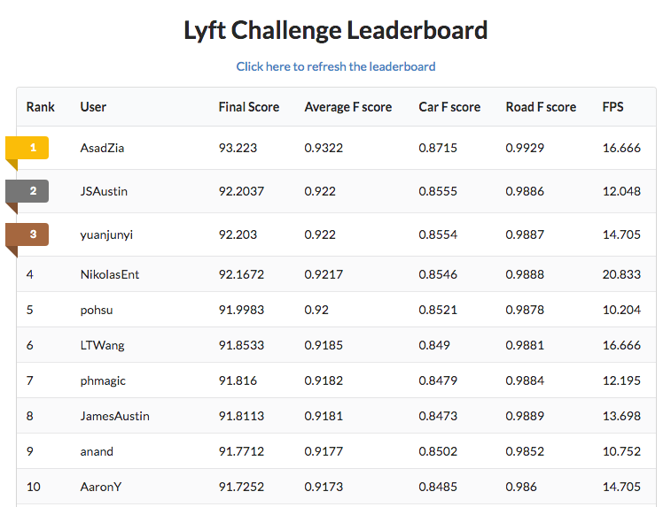
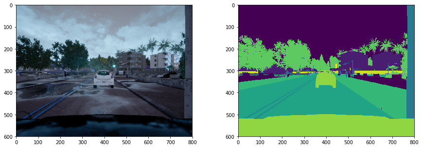
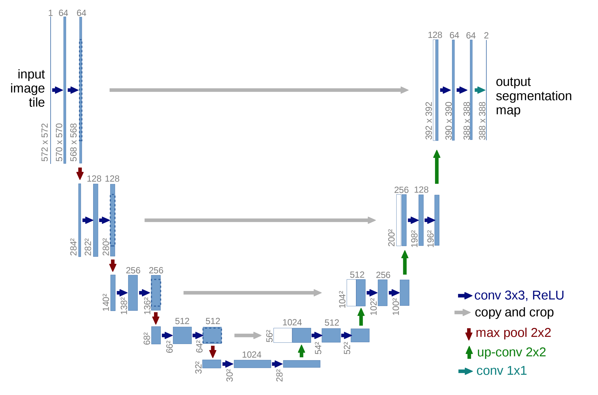
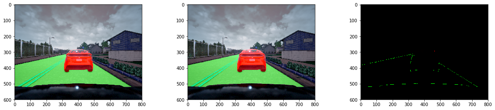
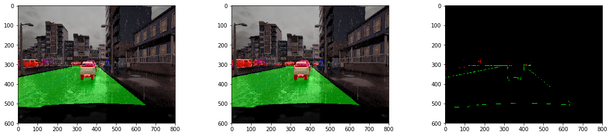
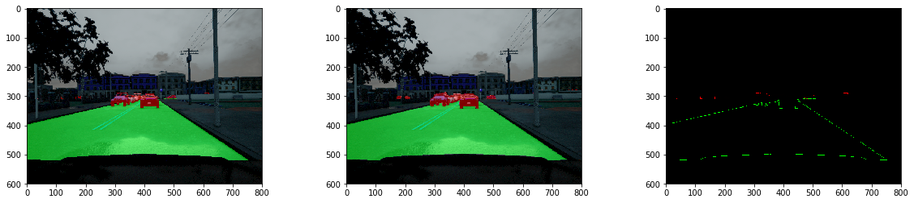
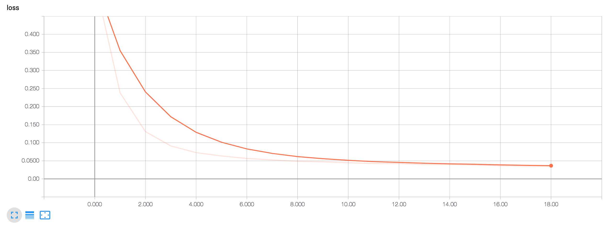
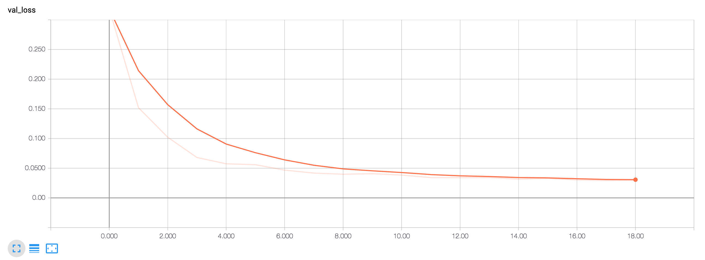
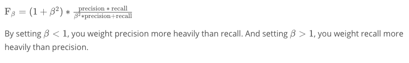
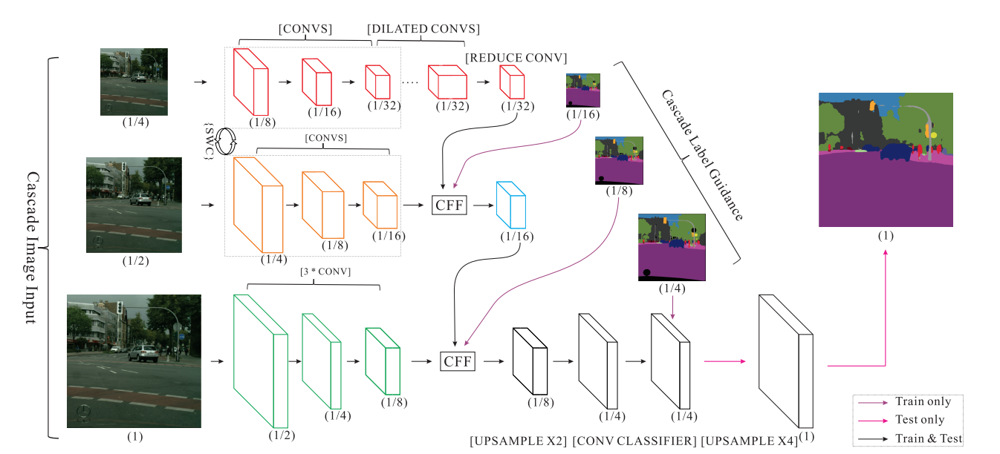

# Semantic Segmentation of Cars and Roads

## Lyft Perception Challenge


Goal:

Pixel-wise segmentation of objects (cars and road surface) from forward-facing camera data inside a simulated car.

Result:

I started the challenge knowing nothing about sematic segmentation. I was certain that I would not even place in the top 100 contenders but I thought:  "What the heck, I like working on deep learning problems".

I'm glad I got to learn alot and even placed 7th overall.



## Data

All camera data for this project comes from the the [CARLA simulator](http://carla.org/). Gathering data from a simulator is much faster than the real-world and allows us to iterate on our perception pipeline quickly before fine tuning it with real world data.

Here's a sample of the input images (left) and the segmentation (right) produced by the simulator.



Each pixel value in the segmented image represents a class of object (pedestrian, cars, lane, roads, etc). 

The challenge provides 1000 images to start with with various weather conditions. 

I discovered very early on that this is not enough data to train my network on. I was coding on a Macbook Air, too puny to run CARLA. However when I trained my network using additional data from a fellow competitor ([@ongchinkiat](https://github.com/ongchinkiat)), I saw my car F-Score immediately shoot up.

So I turned to [paperspace](https://www.paperspace.com/&R=XD92KG3) to rent one of their Windows machine with a decent GPU to capture 12k more images of every weather condition. 

### Data Preprocessing

For this challenge, we're only interested in classifying cars and roads. We're also considering he lane markings as part of the road not its own class. Lastly the hood of our own car will not need to be classified.

So I merge the two classes (lane markings and road surface) into one, mask out the hood portion of our own car, and remove the rest of the classes.

Since top of the image is the sky (we're not detecting flying cars yet) and the bottom is the hood of our car, I cropped out the top and bottom to reduce the size of the input into the network.

### Data Augmentation

After looking through the data provided, I noticed that the car can wobble a bit from side to side. I also noticed that the time of day can affect the brightness of the camera image.

In order to make my classifier robust under these conditions, I chose to randomly augment the input data with brightness, translations, rotations, and zoom perturbations as it is being fed into the network. 

## Neural Network Architecture

### U-Net

Semantic segmentation has made great strides in the recent years starting with the use of fully convolutional networks (FCN).

Typically in a convolutional network used for object classification, the beginning layers encode the image data from 3 dimensions (RGB) to many dimensions. With each layer in depth the network learns more abstracted information about the image: starting from lines to basic shapes to more complex shapes (such as eyes and nose in the case of facial detection). After all the convolutional layers come fully-connected layers, where information about the lines and shape feed into a single vector of probabilities for each object type.

Instead of the fully-connected layers of regular convolutional network, FCNs take the info from the convolutions and apply new convolutions and upsampling to produce the desired output mask, where each pixel corresponds to an object type.


In general, semantic segmentation networks follow an encoder-decoder pattern. The encoder portion takes the low-dimensional image into high-dimension features. The encoder can use existing networks such as ResNet or VGG because they are already well trained to recognized lines, shapes, etc. The decoder portion takes the "encoded" features learned and converts it into pixel-level segmentations.

For my network I chose one of the earliest and simplest encoder-decoder networks out there: U-Net.

U-Net was original proposed for Biomedical Image Segmentation. [See paper here](https://arxiv.org/abs/1505.04597). In the paper, the authors mentioned that U-net can perform well even with few training images. (I only had 1000 images).

Though U-Net was originally designed for biomedical purposes, some of top entries for the Carvana Kaggle competition used U-Net so I was hopeful it would work in this challenge.



The main ideas behind U-Net:

* Use upsampling layers in the "decoder" portion to progressively increase the image data to the desired output dimensions
* Combine the results of the "encoding" layers with the upsampling layers to help localize features

Since U-Net has been around for a while, there are many existing open source implementations of U-Net out there.

Instead of re-creating U-Net, I used [Peter Giannakopoulos' Keras implementation](https://github.com/petrosgk/Kaggle-Carvana-Image-Masking-Challenge) which is based on [Heng CherKeng's PyTorch implementation](https://www.kaggle.com/c/carvana-image-masking-challenge/discussion/37208). I wanted to spend more time reading and understanding the papers instead of worrying about syntax. I also knew that there were many talented people who have bravely taken on the task of implementing these networks.

Unlike the U-Net diagram above (which has 5 downsampling levels), Peter implemented U-Nets with different numbers of downsampling levels, from 5 to 8 downsampling steps. Peter has also added BatchNormalization on every convolution step.

My minor modifications to Peter's code are:

* Remove the compile step from the model generation function, this allows the inference step to load the model much faster
* Updated the weighted loss functions to allow for arbitrary image sizes (instead of just sizes that are powers of 2)

## Training

### Final

My final model was trained using a U-Net network with 7 downsampling steps.

While Peter's implementation used RMSProp with a base learning rate of 0.0001, I used the Adam optimizer (which adds momentum) with a base learning rate of 0.0001. I chose this to reduce training time on the first few epochs after observing how the network trains and performs using RMSProp.

I set the target number of epochs to 100, but I have an EarlyStopping Keras callback that checks the validation loss to see if it has remained steady for at least 3 epochs. I also added Peter's usage of reducing the learning rate by a factor of 10 on loss plateau for 2 epochs.

Given the network size and input image size, I trained on batches of 8 images at a time on a NVidia Quadro P4000.

Input shape: (256, 512, 3) (cropped and resized).
Used `Adam(lr=0.0001)` and Weighted Binary Cross Entropy + Dice Loss.
Trained with ~10.5k images.
Validated with ~1.4k images.
Tested with ~100 images.

Here are some segmented results from the test set. 

The images are laid out (from left to right): Ground Truth, Predictions, Difference







F-scores from test set:
Car F-Score: 0.9586899702675569, Precision: 0.8562120177132897, Recall: 0.9882606026140918
Road F-Score: 0.9955710958847426, Precision: 0.9992398830797123, Recall: 0.9811614525773936

Tensorboard Loss Visualizations:






### Start

As my baseline, I used Peter's implementation of unet_128 (which has 5 levels of downsampling).

Input shape: (320, 800, 3) (cropped)
Used `RMSProp(lr=0.0001)` and Binary Cross Entropy + Dice Loss.
Trained with 850 images.
Validated with 100 images.
Tested with 50 images.

Here are my results:
```
Your program runs at 5.714 FPS

Car F score: 0.502 | Car Precision: 0.208 | Car Recall: 0.777 | Road F score: 0.905 | Road Precision: 0.899 | Road Recall: 0.926 | Averaged F score: 0.703
```
The network has no trouble detecting the road but a lot of trouble with the cars. 

Factors that affected F-Scores:

* Using the same probability cutoffs for both classes (there are a lot less cars in the training data)
* Not enough training data with cars (or not enough data augmentation)

Factors that affected inference speed:

* Using PIL to resize and encode images to JSON instead of opencv
* Using out-of-the-box code compiles the model for the inference step (which is unnecessary)
* Size of input image

### Weighted F-Score

The challenge grades and ranks participants on a weighted F-score. 

It's more important to have better precision on detecting the road surface and better recall on cars (because you'd rather avoid a non-existent car (false positive) than crash into one you didn't detect (false negative)).



It was chosen that the beta for cars would be 2 and beta for roads would be 0.5.

After reviewing the video segmentation samples from the model, the car precision is still unacceptably poor. In my video outputs, there were many false positive for cars, which could lead to a jerky rider experience for a real self driving car.

I use a weighted loss function and different probability thresholds for the cars vs roads. Furthermore, when the output (binary mask) of the network is resized to fit the frame of the video, I made sure that the car masks included more of the fringe artifacts of resizing than the roads.

### Performance Tuning

Since the measure of FPS is from when the script starts up to when the script finishes processes all the frames of the video, I decided to perform an audit of the bottlenecks in the demo.py script (which I used as a base).

I found that loading the model takes a lot of time (esp if the model needs to be compiled). I also discovered that using PIL to encode the JSON was eating up at least 2 FPS.

In the real world, the models are ideally already loaded into memory so inference can be quicker.

Once these fixes were in place, I tuned the inference speed of the network.

Inference speed depended heavily on the input size of the image. In subsequent trials, I found that the image size 256x512 produced good and fast results. Anything smaller had poor accuracy, anything bigger sacrificed a lot of speed.

Here are some results of experimenting with input sizes:

Input shape: (256, 800, 3) (cropped)
Used `RMSProp(lr=0.0001)` and Binary Cross Entropy + Dice Loss.
Trained with 10.5k images.
Validated with 1.4k images.
Tested with 100 images.

```
Your program runs at 8.474 FPS

Car F score: 0.746 | Car Precision: 0.685 | Car Recall: 0.763 | Road F score: 0.981 | Road Precision: 0.984 | Road Recall: 0.971 | Averaged F score: 0.864
```

Input shape: (128, 256, 3) (cropped)
Used `RMSProp(lr=0.0001)` and Binary Cross Entropy + Dice Loss.
Trained with 10.5k images.
Validated with 1.4k images.
Tested with 100 images.

```
Your program runs at 9.615 FPS

Car F score: 0.712 | Car Precision: 0.733 | Car Recall: 0.707 | Road F score: 0.968 | Road Precision: 0.980 | Road Recall: 0.921 | Averaged F score: 0.840
```

### Additional Data

After updating the network to use a weighted loss function and adjusting the threshold for pixel-wise probabilities, I still found that my network was not good at detecting cars.

I had already augmented the training data and the network performs well on my test set. This meant that my training, valid, and test set was not representative of the real tests ran on my network.

Luckily in this case, data gathering is a relatively easy task with the CARLA sim. If I was dealing with real world images, I would: try to find similar labeled data sets, try to find a network with weights already trained on real world data sets, or try to create real world images through graphics editing.

I collected data on Town_01 and Town_02 in the CARLA simulator for all weather conditions and various pedestrian / car populations.

My final set of data contained ~ 12,000 images.

## Further Improvements

### Architectures

Before settling on U-Net I looked at many other architectures for semantic segmentation. Here's a nice [list](https://github.com/mrgloom/awesome-semantic-segmentation) and a [blog post](http://blog.qure.ai/notes/semantic-segmentation-deep-learning-review) that helped me with how each paper contributed to present day state of the art.

A few of the architectures that I'd love to try them out in the future:

##### [PSPNet](https://arxiv.org/abs/1612.01105)

Currently considered state of the art for segmentation, PSPNet uses a pyramid pooling structure to decode the feature maps produced by the encoder. The encoder module is ResNet. PSPNet is has high accuracy but can be slow for larger images.


#### [ICNet](https://arxiv.org/abs/1704.08545)

ICNet produces very good results at inference in real time with large images. This is primarily because it splits the input images/masks into 3 sizes to train but only uses the highest resolution input size to infer. 



#### [FRRN](https://github.com/TobyPDE/FRRN)

Specifically developed for autonomous driving, FRRN boasts strong localization and recognition performance by splitting up processing into 2 streams, a feature (residual) stream at full image resolution and a pooling (convolutions and pooling) stream. 

### Inference Speed

If I chose to go with a more complex architecture such as PSPNet, I'll need to improve the inference speed of the network.

One low hanging fruit for optimizing performance is to preload the model and then quickly pass in frame as it is read. I can imagine this to be 2 processes - one inference server and a client that passes along the image data as it is read and gets back the masks.

Another way I can speed up inference speed is to use the GPU to pre-process the data. Performance gains wouldn't be that great with single images, but could be significant with batches of images.

I'd also like to try is TensorRT. Developed by NVidia for use with their GPUs, TensorRT takes frozen TF models and trades off precision for speed. I've heard stories of up to 10x improvement.

### Transfer to Real World

Running my trained network with real world images produced very poor results. My network does not generalize well outside of CARLA.

Some hypotheses on why that is:

* The encoder portion has only ever seen simulator data. If I had used a pre-trained encoder such as ResNet, it would generalize better.
* CARLA is still a very clean world. The real world is full of debris and lighting conditions that hasn't been simulated well. I think some normalization from real world images to CARLA-style images can help with precision, but not much.


[See my source code](UNet-Lyft-512.ipynb)